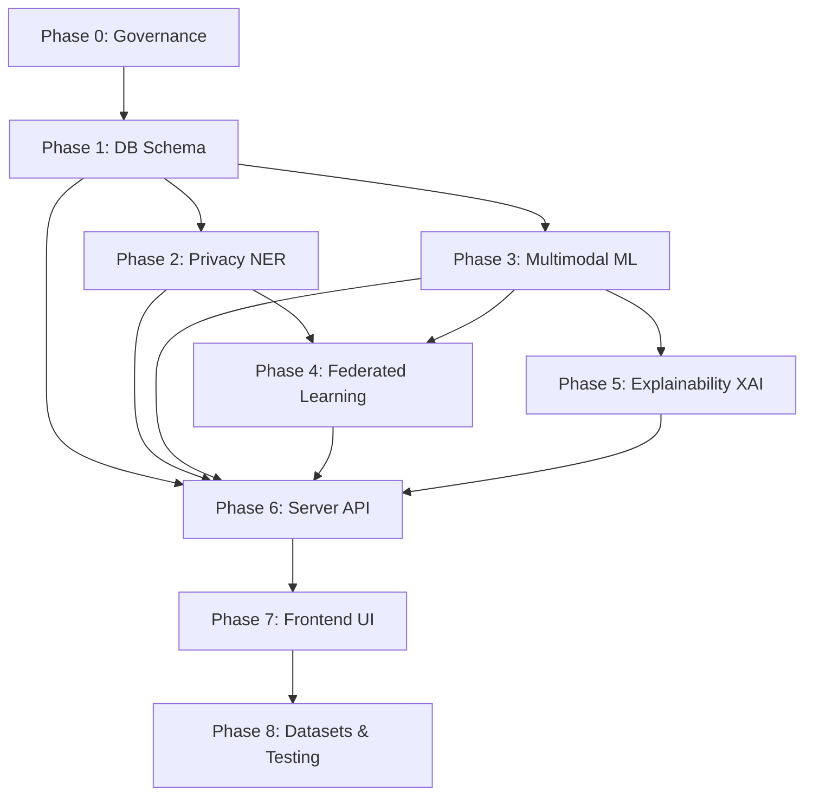

# MedShield FL — Master Project Roadmap & Execution Index

This document serves as the master index and execution blueprint for building **MedShield FL** (Privacy Masked Federated Learning for Heart Disease Diagnosis) in accordance with the project research report.

---

## 📌 Phase Summary & Status

| Phase # | Specification Document | Description | Target Sub-Agent / Domain | Status |
| :---: | :--- | :--- | :--- | :---: |
| **Phase 0** | Root Environment & Configs | AI governance (`GEMINI.md`, `SKILLS.md`, `AGENTS.md`, `Makefile`) | Governance | Completed |
| **Phase 1** | [`docs/01_DATABASE_SCHEMA_AND_MODELS.md`](01_DATABASE_SCHEMA_AND_MODELS.md) | Database tables for Patients, ECG, Text, Predictions & FL rounds | Domain 1 (Backend) | Spec Ready |
| **Phase 2** | [`docs/02_PRIVACY_NER_MODULE.md`](02_PRIVACY_NER_MODULE.md) | spaCy / BERT NER masking pipeline for client-side PII removal | Domain 2 (Privacy & ML) | Spec Ready |
| **Phase 3** | [`docs/03_ML_MULTIMODAL_PIPELINE.md`](03_ML_MULTIMODAL_PIPELINE.md) | BiLSTM (ECG), BERT (Text), Tabular (Lifestyle) & GNN Fusion | Domain 2 (Privacy & ML) | Spec Ready |
| **Phase 4** | [`docs/04_FEDERATED_LEARNING_FLWR.md`](04_FEDERATED_LEARNING_FLWR.md) | Flower (`flwr`) client node & server weight aggregation | Domain 3 (Federation) | Spec Ready |
| **Phase 5** | [`docs/05_EXPLAINABILITY_AND_CAUSAL_AI.md`](05_EXPLAINABILITY_AND_CAUSAL_AI.md) | DiCE counterfactual generator & DoWhy causal inference | Domain 4 (XAI & UI) | Spec Ready |
| **Phase 6** | [`docs/06_SERVER_API_SPEC.md`](06_SERVER_API_SPEC.md) | FastAPI diagnostic & orchestration endpoints | Domain 1 (Backend) | Spec Ready |
| **Phase 7** | [`docs/07_FRONTEND_REACT_DASHBOARD.md`](07_FRONTEND_REACT_DASHBOARD.md) | Interactive React.js clinician & patient dashboard | Domain 4 (XAI & UI) | Spec Ready |
| **Phase 8** | [`docs/08_TESTING_AND_DATASETS.md`](08_TESTING_AND_DATASETS.md) | Datasets setup (MIT-BIH, UCI), synthetic data & end-to-end tests | All Domains | Spec Ready |

---

## 👥 Individual Team Member AI Agent Execution Guides

For step-by-step instructions, blueprint references, and AI pair-programming prompt templates for each team member:

* 👤 **Member 1 Guide**: [`docs/MEMBER_1_EXECUTION_GUIDE.md`](MEMBER_1_EXECUTION_GUIDE.md) *(Systems Architecture, Database & Distributed FL Lead)*
* 👤 **Member 2 Guide**: [`docs/MEMBER_2_EXECUTION_GUIDE.md`](MEMBER_2_EXECUTION_GUIDE.md) *(Pure Machine Learning & Explainable AI Lead)*
* 👤 **Member 3 Guide**: [`docs/MEMBER_3_EXECUTION_GUIDE.md`](MEMBER_3_EXECUTION_GUIDE.md) *(Privacy Engine, Datasets & Frontend UI Lead)*

---

## 🏗️ Detailed Execution Checklist

### Phase 0: System Infrastructure & AI Governance `[COMPLETED]`
- [x] Configure `GEMINI.md` master system instructions & rules
- [x] Configure `SKILLS.md` developer commands & ruff workflows
- [x] Configure `AGENTS.md` sub-agent execution domains
- [x] Configure root `makefile` shortcuts

### Phase 1: Database Schema Expansion `[PENDING]`
- [ ] Define SQLAlchemy models for `Patient`, `ClinicalRecord`, `ECGRecord`, `Prediction`, `FLRound`
- [ ] Register all models in `server/app/core/models.py`
- [ ] Generate Alembic migration script (`uv run alembic revision --autogenerate`)
- [ ] Apply migration to database (`uv run alembic upgrade head`)

### Phase 2: Privacy & NER Anonymization Layer `[PENDING]`
- [ ] Implement spaCy / BERT NER masking pipeline (`client/privacy/ner_masker.py`)
- [ ] Add Regex fallback anonymizers for SSN, phone numbers, email, dates
- [ ] Create unit tests for PII masking (`client/privacy/test_ner.py`)

### Phase 3: Multimodal ML Model Architecture `[PENDING]`
- [ ] Implement BiLSTM time-series model for ECG signals (`client/ml_models/lstm_model.py`)
- [ ] Implement BERT embedding extractor for clinical notes (`client/ml_models/text_model.py`)
- [ ] Implement Tabular feature encoder for lifestyle data (`client/ml_models/tabular_model.py`)
- [ ] Implement Graph Neural Network (GNN) / Concatenation Fusion head (`client/ml_models/gnn_fusion.py`)

### Phase 4: Federated Learning Orchestration `[PENDING]`
- [ ] Implement Flower FL Client (`client/fl_client.py`)
- [ ] Implement Central FL Server Aggregator (`server/app/features/federation/fl_server.py`)
- [ ] Configure `FedAvg` and `FedProx` weight aggregation strategies
- [ ] Test local multi-hospital client simulation

### Phase 5: Explainability & Causal AI `[PENDING]`
- [ ] Implement DiCE counterfactual generator (`client/explainability/counterfactual.py`)
- [ ] Implement DoWhy causal graphs for heart disease risk factors (`client/explainability/causal_graph.py`)
- [ ] Build API formatting for "What-If" target parameters

### Phase 6: FastAPI Backend Endpoints `[PENDING]`
- [ ] Build Prediction & Data Ingestion API router (`server/app/features/prediction/router.py`)
- [ ] Build FL Round Status & Weight Upload API router (`server/app/features/federation/router.py`)
- [ ] Add JWT protection & RBAC permissions for Clinicians & Admins

### Phase 7: React.js Frontend Dashboard `[PENDING]`
- [ ] Initialize React.js application in `frontend/`
- [ ] Build Clinician View (ECG visualizer, Diagnostic Risk Gauge, Counterfactual Sliders)
- [ ] Build Patient Portal View (Masked summary, Actionable recommendations)
- [ ] Build Hospital Admin View (FL node status monitor)

### Phase 8: Datasets Integration & Validation `[PENDING]`
- [ ] Download & prepare UCI Heart Disease & MIT-BIH ECG datasets
- [ ] Run end-to-end multi-hospital federated training round
- [ ] Execute `uv run ruff check .` and `uv run pytest` test suite

---

## ⚙️ Execution Dependency Rules

1. **Phase 1 (DB Schema)** must precede API creation.
2. **Phase 2 (Privacy)** must run locally on client nodes before any raw data is processed.
3. **Phase 3 (ML)** models must be defined before **Phase 4 (FL)** can exchange model weights.
4. **Phase 6 (Server API)** integrates all backend, ML, Privacy, and FL interfaces.
5. **Phase 7 (Frontend UI)** connects to Phase 6 API endpoints.
