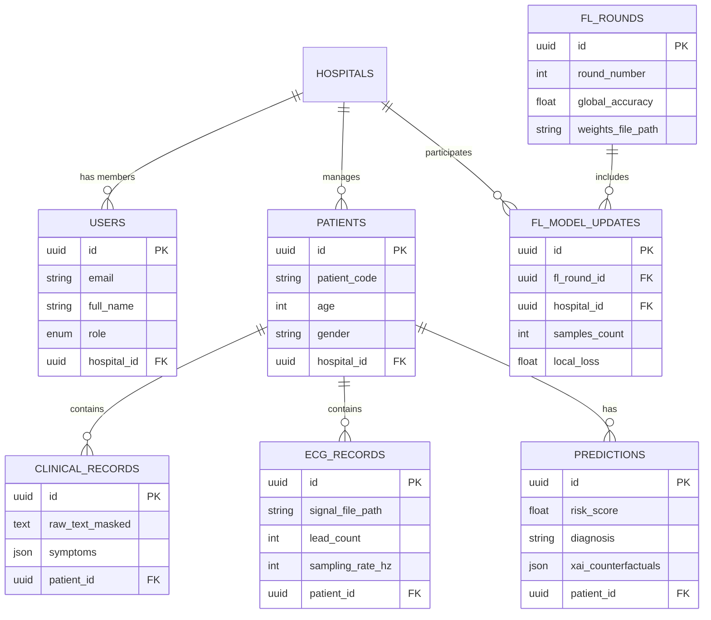

# MedShield FL — Database Schema & Models Blueprint (`Phase 1`)

This document outlines the complete database schema, SQLAlchemy ORM model definitions, table relationships, and Alembic migration procedures for **MedShield FL**.

---

## 🏛️ Database Architectural Overview

The database uses **Async SQLAlchemy 2.0** with **Alembic** for schema migrations.



---

## 📋 Entity Specifications & Models

### 1. `Patient` Model (`server/app/features/patients/models.py`)
Stores anonymized hospital patient demographics.

```python
import uuid
from datetime import datetime
from typing import TYPE_CHECKING
from sqlalchemy import ForeignKey, func
from sqlalchemy.orm import Mapped, mapped_column, relationship
from app.core.database import Base

if TYPE_CHECKING:
    from app.features.hospitals.models import Hospital

class Patient(Base):
    __tablename__ = "patients"

    id: Mapped[uuid.UUID] = mapped_column(primary_key=True, default=uuid.uuid4)
    patient_code: Mapped[str] = mapped_column(unique=True, index=True)  # Anonymized ID e.g., PAT-88402
    age: Mapped[int] = mapped_column()
    gender: Mapped[str] = mapped_column()  # 'M', 'F', 'Other'
    
    hospital_id: Mapped[uuid.UUID] = mapped_column(
        ForeignKey("hospitals.id", ondelete="CASCADE")
    )
    hospital: Mapped["Hospital"] = relationship()

    created_at: Mapped[datetime] = mapped_column(server_default=func.now())
```

---

### 2. `ClinicalRecord` Model (`server/app/features/records/models.py`)
Stores masked clinical notes (PII stripped via NER) and symptoms.

```python
import uuid
from datetime import datetime
from sqlalchemy import ForeignKey, func, JSON, Text
from sqlalchemy.orm import Mapped, mapped_column, relationship
from app.core.database import Base

class ClinicalRecord(Base):
    __tablename__ = "clinical_records"

    id: Mapped[uuid.UUID] = mapped_column(primary_key=True, default=uuid.uuid4)
    patient_id: Mapped[uuid.UUID] = mapped_column(
        ForeignKey("patients.id", ondelete="CASCADE"), index=True
    )
    masked_text: Mapped[str] = mapped_column(Text)  # NER Anonymized clinical notes
    symptoms: Mapped[dict | None] = mapped_column(JSON, default=None)  # e.g., {"chest_pain": True}
    blood_pressure_sys: Mapped[int | None] = mapped_column(default=None)
    blood_pressure_dia: Mapped[int | None] = mapped_column(default=None)
    cholesterol_mg_dl: Mapped[float | None] = mapped_column(default=None)
    fasting_bs_mg_dl: Mapped[float | None] = mapped_column(default=None)

    created_at: Mapped[datetime] = mapped_column(server_default=func.now())
```

---

### 3. `ECGRecord` Model (`server/app/features/records/models.py`)
Metadata for time-series ECG signals processed locally.

```python
class ECGRecord(Base):
    __tablename__ = "ecg_records"

    id: Mapped[uuid.UUID] = mapped_column(primary_key=True, default=uuid.uuid4)
    patient_id: Mapped[uuid.UUID] = mapped_column(
        ForeignKey("patients.id", ondelete="CASCADE"), index=True
    )
    signal_file_path: Mapped[str] = mapped_column()  # Path to local .npy or .mat signal file
    sampling_rate_hz: Mapped[int] = mapped_column(default=500)
    lead_count: Mapped[int] = mapped_column(default=12)
    duration_seconds: Mapped[float] = mapped_column(default=10.0)

    created_at: Mapped[datetime] = mapped_column(server_default=func.now())
```

---

### 4. `Prediction` Model (`server/app/features/prediction/models.py`)
Diagnostic risk predictions and XAI counterfactuals.

```python
class Prediction(Base):
    __tablename__ = "predictions"

    id: Mapped[uuid.UUID] = mapped_column(primary_key=True, default=uuid.uuid4)
    patient_id: Mapped[uuid.UUID] = mapped_column(
        ForeignKey("patients.id", ondelete="CASCADE"), index=True
    )
    risk_score: Mapped[float] = mapped_column()  # 0.0 to 1.0 probability
    diagnosis: Mapped[str] = mapped_column()  # "High Risk", "Moderate Risk", "Low Risk"
    xai_counterfactuals: Mapped[dict | None] = mapped_column(JSON, default=None)  # DiCE output
    causal_impact: Mapped[dict | None] = mapped_column(JSON, default=None)  # DoWhy output
    model_version: Mapped[str] = mapped_column(default="1.0.0")

    created_at: Mapped[datetime] = mapped_column(server_default=func.now())
```

---

### 5. `FLRound` & `FLModelUpdate` Models (`server/app/features/federation/models.py`)
Federated Learning round orchestration and participation logs.

```python
class FLRound(Base):
    __tablename__ = "fl_rounds"

    id: Mapped[uuid.UUID] = mapped_column(primary_key=True, default=uuid.uuid4)
    round_number: Mapped[int] = mapped_column(unique=True, index=True)
    global_accuracy: Mapped[float | None] = mapped_column(default=None)
    global_loss: Mapped[float | None] = mapped_column(default=None)
    weights_path: Mapped[str | None] = mapped_column(default=None)  # Aggregated weights file
    status: Mapped[str] = mapped_column(default="IN_PROGRESS")  # "IN_PROGRESS", "COMPLETED"

    created_at: Mapped[datetime] = mapped_column(server_default=func.now())

class FLModelUpdate(Base):
    __tablename__ = "fl_model_updates"

    id: Mapped[uuid.UUID] = mapped_column(primary_key=True, default=uuid.uuid4)
    fl_round_id: Mapped[uuid.UUID] = mapped_column(
        ForeignKey("fl_rounds.id", ondelete="CASCADE")
    )
    hospital_id: Mapped[uuid.UUID] = mapped_column(
        ForeignKey("hospitals.id", ondelete="CASCADE")
    )
    samples_count: Mapped[int] = mapped_column()
    local_loss: Mapped[float] = mapped_column()

    created_at: Mapped[datetime] = mapped_column(server_default=func.now())
```

---

## 🔄 Registration & Migration Instructions

To apply these models:

1. Import models into `server/app/core/models.py`:
   ```python
   from app.features.hospitals.models import Hospital
   from app.features.users.models import User
   from app.features.patients.models import Patient
   from app.features.records.models import ClinicalRecord, ECGRecord
   from app.features.prediction.models import Prediction
   from app.features.federation.models import FLRound, FLModelUpdate
   ```

2. Run Alembic Commands:
   ```bash
   make makemigration m="add_patient_records_prediction_fl_models"
   make migrate
   ```

---

## ✅ Phase 1 Verification Checklist
- [ ] All 6 models defined with strict type annotations
- [ ] Registered in `server/app/core/models.py`
- [ ] Alembic migration script generated without syntax errors
- [ ] Database migrated cleanly (`make migrate`)
