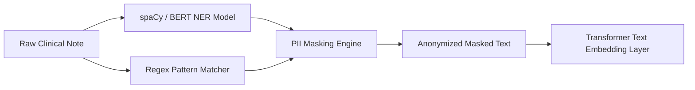

# MedShield FL — Privacy & NER Anonymization Module Blueprint (`Phase 2`)

This document outlines the technical specification for the **Privacy & NER Anonymization Engine** implemented on local hospital client nodes (`/client/privacy/`).

---

## 🔒 Privacy Principle & Guarantee

> **Zero PII Exposure Constraint**: Raw clinical text containing patient identifiers (Names, SSNs, Phone numbers, Addresses, Dates, Hospital IDs) MUST BE anonymized locally before features leave the hospital node or are passed into ML embedding layers.

---

## ⚙️ Module Architecture



---

## 📄 File Structure & Implementation Specs

### 1. `client/privacy/ner_masker.py` (NER Engine)
Uses `spaCy` / Transformers to identify named entities:
- `PERSON` → `[PATIENT_NAME]`
- `DATE` / `TIME` → `[DATE]`
- `GPE` / `LOC` → `[LOCATION]`
- `ORG` → `[HOSPITAL_NAME]`

```python
import spacy

class NERMasker:
    def __init__(self, model_name: str = "en_core_web_sm") -> None:
        """Initialize spaCy NLP model for entity detection."""
        try:
            self.nlp = spacy.load(model_name)
        except OSError:
            # Fallback if model not downloaded
            import spacy.cli
            spacy.cli.download(model_name)
            self.nlp = spacy.load(model_name)

        self.replacement_map: dict[str, str] = {
            "PERSON": "[PATIENT_NAME]",
            "DATE": "[DATE]",
            "TIME": "[DATE]",
            "GPE": "[LOCATION]",
            "LOC": "[LOCATION]",
            "ORG": "[HOSPITAL_NAME]",
        }

    def mask_text(self, text: str) -> str:
        """Scrub named entities from raw clinical text."""
        doc = self.nlp(text)
        masked_text = text
        
        # Sort entities in reverse position order to avoid offset shift
        entities = sorted(doc.ents, key=lambda e: e.start_char, reverse=True)
        for ent in entities:
            if ent.label_ in self.replacement_map:
                placeholder = self.replacement_map[ent.label_]
                masked_text = (
                    masked_text[:ent.start_char]
                    + placeholder
                    + masked_text[ent.end_char:]
                )
        return masked_text
```

---

### 2. `client/privacy/anonymizer.py` (Regex Fallback Rules)
Complements NER to catch numerical patterns (Phone numbers, SSNs, MRNs, Emails):

```python
import re

class PatternAnonymizer:
    def __init__(self) -> None:
        self.patterns: list[tuple[re.Pattern[str], str]] = [
            (re.compile(r"\b\d{3}-\d{2}-\d{4}\b"), "[SSN]"),  # Social Security Number
            (re.compile(r"\b\d{10}\b"), "[PHONE]"),            # 10-digit Phone
            (re.compile(r"\b[A-Za-z0-9._%+-]+@[A-Za-z0-9.-]+\.[A-Z|a-z]{2,}\b"), "[EMAIL]"),
            (re.compile(r"\bMRN-?\d{6,8}\b", re.IGNORECASE), "[MRN]"),  # Medical Record Number
        ]

    def scrub(self, text: str) -> str:
        """Apply regex pattern replacements."""
        scrubbed = text
        for pattern, replacement in self.patterns:
            scrubbed = pattern.sub(replacement, scrubbed)
        return scrubbed
```

---

### 3. Integrated Pipeline (`client/privacy/pipeline.py`)

```python
from client.privacy.anonymizer import PatternAnonymizer
from client.privacy.ner_masker import NERMasker

class PrivacyPipeline:
    def __init__(self) -> None:
        self.ner = NERMasker()
        self.regex = PatternAnonymizer()

    def process(self, raw_clinical_text: str) -> str:
        """Run full privacy scrubbing pipeline."""
        step1 = self.regex.scrub(raw_clinical_text)
        step2 = self.ner.mask_text(step1)
        return step2
```

---

## 🧪 Verification & Unit Test Spec (`client/privacy/test_privacy.py`)

Example Test Cases:
```python
def test_privacy_pipeline():
    pipeline = PrivacyPipeline()
    raw = "Patient John Smith (MRN-994820) visited St. Jude Hospital on 2026-05-12."
    masked = pipeline.process(raw)

    assert "John Smith" not in masked
    assert "994820" not in masked
    assert "[PATIENT_NAME]" in masked or "[MRN]" in masked
```

---

## ✅ Phase 2 Verification Checklist
- [ ] `spaCy` NER model integrated (`en_core_web_sm`)
- [ ] Regex patterns scrub SSNs, MRNs, phone numbers, emails
- [ ] Reverse string character replacement prevents indexing bugs
- [ ] Unit tests pass cleanly with zero PII residual leak
