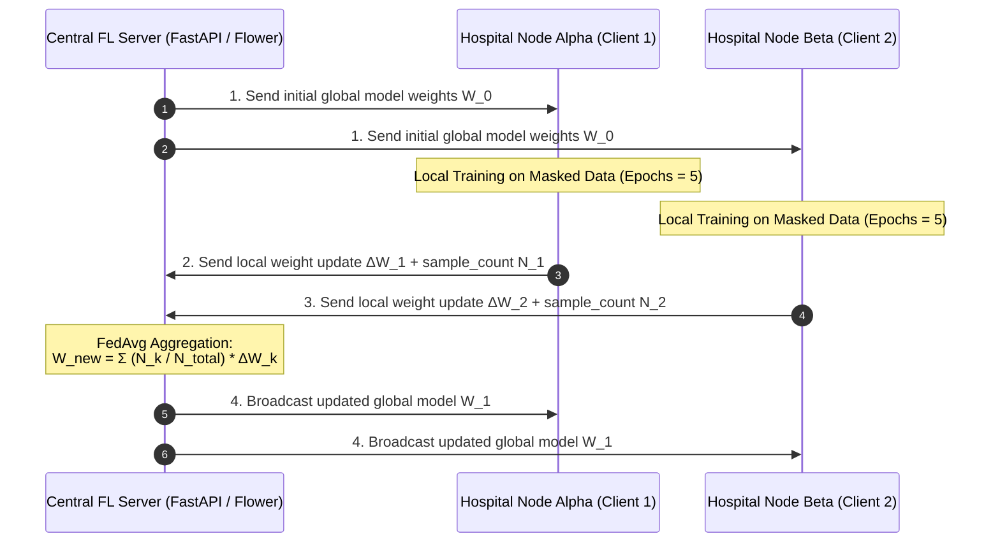

# MedShield FL — Federated Learning Framework Blueprint (`Phase 4`)

This document specifies the integration of the **Flower (`flwr`) Framework** for distributed, privacy-preserving model training across hospital nodes (`client/fl_client.py` & `server/app/features/federation/`).

---

## 🌐 Federated Learning Architecture



---

## 📄 Client Implementation Specification (`client/fl_client.py`)

The Flower client inherits from `flwr.client.NumPyClient`.

```python
import argparse
import flwr as fl
import torch
import torch.nn as nn
from collections import OrderedDict

from client.ml_models.full_model import MedShieldDiagnosticNet

class MedShieldFLClient(fl.client.NumPyClient):
    def __init__(self, hospital_id: str, train_loader: torch.utils.data.DataLoader, val_loader: torch.utils.data.DataLoader) -> None:
        self.hospital_id = hospital_id
        self.model = MedShieldDiagnosticNet()
        self.train_loader = train_loader
        self.val_loader = val_loader
        self.device = torch.device("cuda" if torch.cuda.is_available() else "cpu")
        self.model.to(self.device)

    def get_parameters(self, config: dict) -> list[torch.Tensor]:
        """Extract PyTorch model state dict as a list of NumPy arrays."""
        return [val.cpu().numpy() for _, val in self.model.state_dict().items()]

    def set_parameters(self, parameters: list[torch.Tensor]) -> None:
        """Set local PyTorch model weights from received aggregated parameters."""
        params_dict = zip(self.model.state_dict().keys(), parameters)
        state_dict = OrderedDict({k: torch.tensor(v) for k, v in params_dict})
        self.model.load_state_dict(state_dict, strict=True)

    def fit(self, parameters: list[torch.Tensor], config: dict) -> tuple[list[torch.Tensor], int, dict]:
        """Train model locally on client hospital data."""
        self.set_parameters(parameters)
        self.model.train()
        
        optimizer = torch.optim.Adam(self.model.parameters(), lr=1e-3)
        criterion = nn.CrossEntropyLoss()
        
        epochs = config.get("epochs", 5)
        running_loss = 0.0

        for _ in range(epochs):
            for batch in self.train_loader:
                ecg, input_ids, attn_mask, tab, targets = batch
                ecg, input_ids = ecg.to(self.device), input_ids.to(self.device)
                attn_mask, tab = attn_mask.to(self.device), tab.to(self.device)
                targets = targets.to(self.device)

                optimizer.zero_grad()
                outputs = self.model(ecg, input_ids, attn_mask, tab)
                loss = criterion(outputs, targets)
                loss.backward()
                optimizer.step()

                running_loss += loss.item()

        num_samples = len(self.train_loader.dataset)
        avg_loss = running_loss / len(self.train_loader)
        
        return self.get_parameters(config={}), num_samples, {"loss": float(avg_loss)}

    def evaluate(self, parameters: list[torch.Tensor], config: dict) -> tuple[float, int, dict]:
        """Evaluate aggregated global model on local hospital validation data."""
        self.set_parameters(parameters)
        self.model.eval()
        
        criterion = nn.CrossEntropyLoss()
        correct, total_loss, total_samples = 0, 0.0, 0

        with torch.no_grad():
            for batch in self.val_loader:
                ecg, input_ids, attn_mask, tab, targets = batch
                ecg, input_ids = ecg.to(self.device), input_ids.to(self.device)
                attn_mask, tab = attn_mask.to(self.device), tab.to(self.device)
                targets = targets.to(self.device)

                outputs = self.model(ecg, input_ids, attn_mask, tab)
                loss = criterion(outputs, targets)
                
                total_loss += loss.item() * targets.size(0)
                preds = outputs.argmax(dim=1)
                correct += (preds == targets).sum().item()
                total_samples += targets.size(0)

        accuracy = correct / total_samples
        avg_loss = total_loss / total_samples
        
        return float(avg_loss), total_samples, {"accuracy": float(accuracy)}
```

---

## 🖥️ Central Server FL Strategy (`server/app/features/federation/strategy.py`)

Uses customized **`FedAvg`** / **`FedProx`** aggregation to handle non-IID healthcare dataset distributions.

```python
import flwr as fl

def get_fl_strategy(min_clients: int = 2) -> fl.server.strategy.FedAvg:
    """Configure FedAvg strategy for hospital weight aggregation."""
    return fl.server.strategy.FedAvg(
        fraction_fit=1.0,           # Train on all available connected hospital nodes
        fraction_evaluate=1.0,      # Evaluate on all connected nodes
        min_fit_clients=min_clients,
        min_evaluate_clients=min_clients,
        min_available_clients=min_clients,
    )
```

---

## 🚀 Launching FL Rounds

### 1. Server Entrypoint (`server/app/features/federation/fl_server.py`)
```python
import flwr as fl
from server.app.features.federation.strategy import get_fl_strategy

def start_fl_server(rounds: int = 5, port: int = 8080) -> None:
    strategy = get_fl_strategy()
    fl.server.start_server(
        server_address=f"0.0.0.0:{port}",
        config=fl.server.ServerConfig(num_rounds=rounds),
        strategy=strategy,
    )
```

### 2. Client Launch Command
```bash
python client/fl_client.py --server 127.0.0.1:8080 --hospital-id hospital_01
```

---

## ✅ Phase 4 Verification Checklist
- [ ] `MedShieldFLClient` inherits from `flwr.client.NumPyClient`
- [ ] Weight extraction (`get_parameters`) and loading (`set_parameters`) match PyTorch state dict keys
- [ ] Local training (`fit`) outputs parameters, sample count, and loss
- [ ] Local evaluation (`evaluate`) outputs loss, sample count, and accuracy metric
- [ ] `FedAvg` aggregation strategy configured on central server
