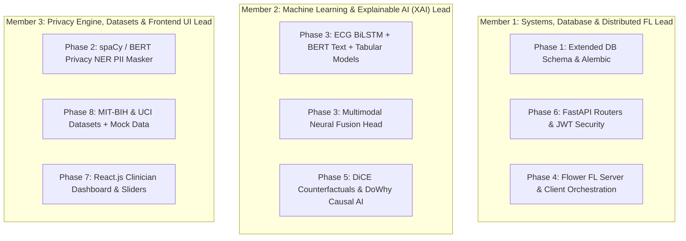

# MedShield FL — VTU Major Project Workload Division (Phase 2)

This document specifies the **equal and concurrent workload distribution for a 3-member team** working on **MedShield FL** for the **VTU Final Year Computer Science Major Project (Phase 2)** evaluation.

---

## 🎓 VTU Evaluation Criteria Alignment

To score maximum marks under VTU Phase 2 evaluation rubrics (Internal Guide + External Examiner viva), the work is split into **3 distinct engineering domains**. Each team member gets full ownership of a specialized architectural domain (Systems/FL, Machine Learning/XAI, and Privacy/UI), ensuring clear individual contribution during the viva voce examination.



---

## 👤 Member 1: Systems Architecture, Database & Distributed FL Lead

### **Assigned Domain**: Server Core, Database Migrations, REST API & Federated Learning Orchestration
* **Assigned Blueprints & Execution Guide**:
  * 📘 **Step-by-Step AI Execution Guide**: [`docs/MEMBER_1_EXECUTION_GUIDE.md`](MEMBER_1_EXECUTION_GUIDE.md)
  * [`docs/01_DATABASE_SCHEMA_AND_MODELS.md`](01_DATABASE_SCHEMA_AND_MODELS.md)
  * [`docs/06_SERVER_API_SPEC.md`](06_SERVER_API_SPEC.md)
  * [`docs/04_FEDERATED_LEARNING_FLWR.md`](04_FEDERATED_LEARNING_FLWR.md) *(Server Aggregator & Client Runner)*

### **Core Tasks & Code Ownership**:
1. **SQLAlchemy DB Schemas**: Build `Patient`, `ClinicalRecord`, `ECGRecord`, `Prediction`, `FLRound`, and `FLModelUpdate` tables in `server/app/features/`.
2. **Alembic DB Migrations**: Generate and apply DB schema migration scripts (`uv run alembic upgrade head`).
3. **FastAPI Endpoint Routers**: Implement REST API endpoints for `/auth`, `/users`, `/hospitals`, `/prediction`, and `/federation`.
4. **OAuth2 JWT Security & RBAC**: Enforce Role-Based Access Control (`SUPER_ADMIN`, `HOSPITAL_ADMIN`, `CLINICIAN`).
5. **Federated Learning Orchestration**: Code central server `FedAvg`/`FedProx` weight aggregator (`server/app/features/federation/fl_server.py`) and Flower client node runner (`client/fl_client.py` for weight serialization & local FL sync).

### **VTU Viva Voce Presentation Topics**:
* Async SQLAlchemy 2.0 ORM database normalization & performance.
* OAuth2 JWT authentication security & role-based permission control.
* Distributed Federated Learning network topology & `FedAvg`/`FedProx` aggregation math.

---

## 👤 Member 2: Machine Learning & Explainable AI (XAI) Lead

### **Assigned Domain**: PyTorch Multimodal Models, Neural Fusion & Explainable Causal AI
* **Assigned Blueprints & Execution Guide**:
  * 📘 **Step-by-Step AI Execution Guide**: [`docs/MEMBER_2_EXECUTION_GUIDE.md`](MEMBER_2_EXECUTION_GUIDE.md)
  * [`docs/03_ML_MULTIMODAL_PIPELINE.md`](03_ML_MULTIMODAL_PIPELINE.md)
  * [`docs/05_EXPLAINABILITY_AND_CAUSAL_AI.md`](05_EXPLAINABILITY_AND_CAUSAL_AI.md)

### **Core Tasks & Code Ownership**:
1. **ECG BiLSTM Model**: Code 1D-Conv + Bidirectional LSTM model for 12-lead time-series signals in `client/ml_models/lstm_model.py`.
2. **Clinical Text BERT**: Code Bio_ClinicalBERT transformer feature extractor in `client/ml_models/text_model.py`.
3. **Tabular Feature Model**: Code tabular encoder for patient lifestyle & clinical features in `client/ml_models/tabular_model.py`.
4. **Multimodal Fusion Head**: Code PyTorch Graph Neural Network (GNN) / Concatenation fusion layer in `client/ml_models/gnn_fusion.py`.
5. **DiCE Counterfactual Explainer**: Code `CounterfactualExplainer` in `client/explainability/counterfactual.py` to calculate "What-If" target parameters for risk reduction.
6. **DoWhy Causal AI Engine**: Code `CausalInferenceEngine` in `client/explainability/causal_graph.py` to build causal DAGs estimating feature cause-effect relationships.

### **VTU Viva Voce Presentation Topics**:
* Multimodal deep learning architectures (ECG BiLSTM time-series + Bio_ClinicalBERT text embeddings + GNN Fusion).
* Counterfactual explanation generation algorithms (`DiCE`) for actionable clinical recommendations.
* Causal AI inference engines (`DoWhy`) & Directed Acyclic Graph (DAG) cause-effect estimation.

---

## 👤 Member 3: Privacy Engine, Data Engineering & Frontend UI Lead

### **Assigned Domain**: Privacy NER Anonymizer, Medical Datasets, React UI Dashboard & Pytest
* **Assigned Blueprints & Execution Guide**:
  * 📘 **Step-by-Step AI Execution Guide**: [`docs/MEMBER_3_EXECUTION_GUIDE.md`](MEMBER_3_EXECUTION_GUIDE.md)
  * [`docs/02_PRIVACY_NER_MODULE.md`](02_PRIVACY_NER_MODULE.md)
  * [`docs/07_FRONTEND_REACT_DASHBOARD.md`](07_FRONTEND_REACT_DASHBOARD.md)
  * [`docs/08_TESTING_AND_DATASETS.md`](08_TESTING_AND_DATASETS.md)

### **Core Tasks & Code Ownership**:
1. **Privacy NER Pipeline**: Build `spaCy` / BERT Named Entity Recognition entity extractor (`client/privacy/ner_masker.py`) to extract and scrub PII from clinical text notes.
2. **Regex Fallback Anonymizer**: Build regex scrubber (`client/privacy/anonymizer.py`) for SSN, phone numbers, emails, and dates.
3. **Datasets & Synthetic Data Pipeline**: Download & process MIT-BIH ECG & UCI Heart Disease datasets, and build synthetic multi-hospital patient data generator (`generate_mock_data.py`).
4. **React.js Dashboard Application**: Initialize `frontend/` (Vite + React.js) and build Clinician Diagnostic View, Patient Portal View, and Hospital Admin FL Monitor.
5. **Interactive UI Components**: Implement `CounterfactualSlider.jsx` (real-time risk slider) and `FLTrainingMonitor.jsx` (Recharts accuracy graph).
6. **System Test Suite**: Write unit & end-to-end `pytest` suites (`tests/`) verifying privacy masking, dataset integrity, and API contracts.

### **VTU Viva Voce Presentation Topics**:
* Named Entity Recognition (NER) masking algorithms & zero PII exposure guarantees under HIPAA/GDPR rules.
* Multi-hospital clinical dataset preparation pipelines & synthetic data generation.
* React 18 component design system, state management, & real-time risk visualization dashboard.

---

## 🔀 Concurrent Git Workflow (Simultaneous Development)

To work simultaneously without git merge conflicts across team members:

```bash
# Member 1 Branch (Backend, DB & FL Orchestration)
git checkout -b feature/systems-db-fl

# Member 2 Branch (ML Models & Explainable AI)
git checkout -b feature/ml-models-xai

# Member 3 Branch (Privacy NER, Datasets & React UI)
git checkout -b feature/privacy-datasets-reactui
```

### Decoupled Collaboration Boundaries:
1. **API Contracts**: Member 1 provides Pydantic response schemas (`docs/06`) early so Member 3 can build React UI components with mock JSON while Member 2 builds PyTorch ML models.
2. **Strict Code Isolation**:
   * Member 1 works in `server/app/` and `client/fl_client.py`.
   * Member 2 works in `client/ml_models/` and `client/explainability/`.
   * Member 3 works in `client/privacy/`, `client/data/`, `frontend/`, and `tests/`.

---

## ⚖️ Workload Balance & Fairness Justification

This division achieves equal effort (~33% / ~34% / ~33%) across lines of code, technical complexity, and VTU viva presentation impact:

| Evaluation Metric | Member 1 (Systems & FL) | Member 2 (ML & XAI) | Member 3 (Privacy, Data & UI) |
| :--- | :--- | :--- | :--- |
| **Technical Stack** | FastAPI, Async SQLAlchemy, Alembic, JWT, Flower Server & Client | PyTorch, HuggingFace BERT, 1D-Conv BiLSTM, DiCE, DoWhy | spaCy NER, React.js, Vite, Recharts, Pytest, Pandas |
| **Lines of Code (approx.)** | ~33% of codebase | ~34% of codebase | ~33% of codebase |
| **Algorithmic Complexity** | High (Security, Async DB, `FedAvg`/`FedProx` FL weight sync) | High (Multi-modal deep learning, GNN fusion, counterfactual search, causal DAGs) | High (NER entity extraction, React state management, dataset pipelines, E2E tests) |
| **VTU Viva Impressiveness** | **Very Strong**: Enterprise API & DB architecture + FL network orchestration | **Very Strong**: State-of-the-art Deep Learning models + Explainable AI (XAI) | **Very Strong**: Zero-PII privacy anonymization engine + Modern Clinician React UI |
