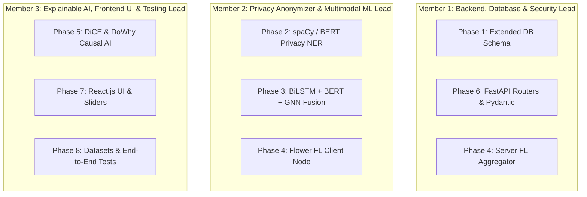

# MedShield FL — VTU Major Project Workload Division (Phase 2)

This document specifies the **equal and concurrent workload distribution for a 3-member team** working on **MedShield FL** for the **VTU Final Year Computer Science Major Project (Phase 2)** evaluation.

---

## 🎓 VTU Evaluation Criteria Alignment

To score maximum marks under VTU Phase 2 evaluation rubrics (Internal Guide + External Examiner viva), the work is split into **3 distinct engineering domains**. Each team member gets full ownership of a specific architectural domain, ensuring clear individual contribution during the viva voce examination.



---

## 👤 Member 1: Backend Architecture, Database & Security Lead

### **Assigned Domain**: Server Core, DB Migrations, REST API & FL Server Aggregator
* **Assigned Blueprints**:
  * [`docs/01_DATABASE_SCHEMA_AND_MODELS.md`](01_DATABASE_SCHEMA_AND_MODELS.md)
  * [`docs/06_SERVER_API_SPEC.md`](06_SERVER_API_SPEC.md)
  * [`docs/04_FEDERATED_LEARNING_FLWR.md`](04_FEDERATED_LEARNING_FLWR.md) *(Server-side aggregation)*

### **Core Tasks & Code Ownership**:
1. **SQLAlchemy DB Schemas**: Build `Patient`, `ClinicalRecord`, `ECGRecord`, `Prediction`, `FLRound`, and `FLModelUpdate` tables in `server/app/features/`.
2. **Alembic Migrations**: Generate and run DB migration scripts (`make migrate`).
3. **FastAPI Endpoint Routers**: Implement REST API routes for `/auth`, `/users`, `/hospitals`, `/prediction`, and `/federation`.
4. **JWT Security & RBAC**: Enforce Role-Based Access Control (`SUPER_ADMIN`, `HOSPITAL_ADMIN`, `CLINICIAN`).
5. **Server FL Strategy**: Implement `FedAvg`/`FedProx` weight aggregation script (`server/app/features/federation/fl_server.py`).

### **VTU Viva Viva-Voce Presentation Topics**:
* Async SQLAlchemy 2.0 ORM performance & database normalization.
* OAuth2 JWT authentication flow and security permissions.
* Central server `FedAvg` weight aggregation math & security.

---

## 👤 Member 2: Privacy Anonymization & Multimodal ML Lead

### **Assigned Domain**: Privacy NER Engine, PyTorch Multimodal Models & Flower FL Client
* **Assigned Blueprints**:
  * [`docs/02_PRIVACY_NER_MODULE.md`](02_PRIVACY_NER_MODULE.md)
  * [`docs/03_ML_MULTIMODAL_PIPELINE.md`](03_ML_MULTIMODAL_PIPELINE.md)
  * [`docs/04_FEDERATED_LEARNING_FLWR.md`](04_FEDERATED_LEARNING_FLWR.md) *(Client-side FL training)*

### **Core Tasks & Code Ownership**:
1. **Privacy NER Pipeline**: Build `spaCy` NLP entity extractor (`ner_masker.py`) and Regex anonymizer (`anonymizer.py`) in `client/privacy/` to scrub PII.
2. **ECG BiLSTM Model**: Code 1D-Conv + Bidirectional LSTM model for 12-lead time-series signals in `client/ml_models/lstm_model.py`.
3. **Clinical Text BERT**: Code Bio_ClinicalBERT transformer feature extractor in `client/ml_models/text_model.py`.
4. **Multimodal GNN Fusion**: Code GNN / Concatenation fusion head in `client/ml_models/gnn_fusion.py`.
5. **Flower FL Client**: Code `MedShieldFLClient` (`client/fl_client.py`) for local hospital training & weight serialization.

### **VTU Viva Viva-Voce Presentation Topics**:
* Named Entity Recognition (NER) masking algorithms & zero PII exposure guarantees.
* Multimodal deep learning architectures (BiLSTM time-series + BERT transformer embeddings).
* Local client model training loop (`fit` / `evaluate`) using Flower (`flwr`).

---

## 👤 Member 3: Explainable AI (XAI), Frontend UI & Testing Lead

### **Assigned Domain**: DiCE Counterfactuals, DoWhy Causal Graphs, React UI Dashboard & Datasets
* **Assigned Blueprints**:
  * [`docs/05_EXPLAINABILITY_AND_CAUSAL_AI.md`](05_EXPLAINABILITY_AND_CAUSAL_AI.md)
  * [`docs/07_FRONTEND_REACT_DASHBOARD.md`](07_FRONTEND_REACT_DASHBOARD.md)
  * [`docs/08_TESTING_AND_DATASETS.md`](08_TESTING_AND_DATASETS.md)

### **Core Tasks & Code Ownership**:
1. **DiCE Counterfactual Explainer**: Build `CounterfactualExplainer` in `client/explainability/counterfactual.py` to generate "What-If" parameter recommendations.
2. **DoWhy Causal Graph**: Build `CausalInferenceEngine` in `client/explainability/causal_graph.py` estimating cause-effect relationships.
3. **React.js Dashboard**: Initialize `frontend/` (Vite + React) and build Clinician View, Patient Portal, and Admin FL Monitor.
4. **Interactive UI Components**: Implement `CounterfactualSlider.jsx` (real-time risk reduction slider) and `FLTrainingMonitor.jsx` (Recharts accuracy graph).
5. **Datasets & Test Suite**: Build synthetic multi-hospital dataset generator (`generate_mock_data.py`), integrate UCI/MIT-BIH datasets, and write `pytest` suites.

### **VTU Viva Viva-Voce Presentation Topics**:
* Counterfactual explanation generation (`DiCE`) & Causal AI (`DoWhy`) DAGs.
* React 18 component design system, state management, & real-time risk simulation UI.
* End-to-end system testing, synthetic multi-hospital simulation, & diagnostic benchmark metrics.

---

## 🔀 Concurrent Git Workflow (Simultaneous Development)

To work simultaneously without git merge conflicts:

```bash
# Member 1 Branch
git checkout -b feature/backend-db-api

# Member 2 Branch
git checkout -b feature/privacy-ml-flclient

# Member 3 Branch
git checkout -b feature/xai-react-testing
```

1. **Decoupled API Contract**: Member 1 provides Pydantic response schemas (`docs/06`) early so Member 3 can build React frontend components using mock JSON data while Member 2 builds PyTorch ML models.
2. **Independent Folders**:
   * Member 1 works primarily in `server/`
   * Member 2 works primarily in `client/privacy/` and `client/ml_models/`
   * Member 3 works primarily in `client/explainability/`, `frontend/`, and `client/data/`

---

## ⚖️ Workload Balance & Fairness Justification

This division is balanced (approx. 33% / 33% / 34%) across code volume, algorithmic complexity, and viva presentation weight:

| Dimension | Member 1 (Backend & DB) | Member 2 (Privacy & ML) | Member 3 (XAI, UI & Testing) |
| :--- | :--- | :--- | :--- |
| **Technical Stack** | FastAPI, Async SQLAlchemy, Alembic, JWT, Flower Server | PyTorch, spaCy NLP, HuggingFace BERT, Flower Client | React.js, DiCE, DoWhy Causal AI, Pytest, Recharts |
| **Lines of Code (approx.)** | ~33% of codebase | ~33% of codebase | ~34% of codebase |
| **Algorithmic Complexity** | Moderate-High (Security, Async DB, `FedAvg` aggregation) | High (Deep Learning architectures & NLP entity extraction) | High (Counterfactual search, Causal graphs, UI state) |
| **VTU Viva Impressiveness** | **Very Strong**: Demonstrates enterprise API & DB design | **Very Strong**: Demonstrates state-of-the-art AI & privacy engineering | **Very Strong**: Demonstrates Explainable AI (XAI) & clinician UI |

